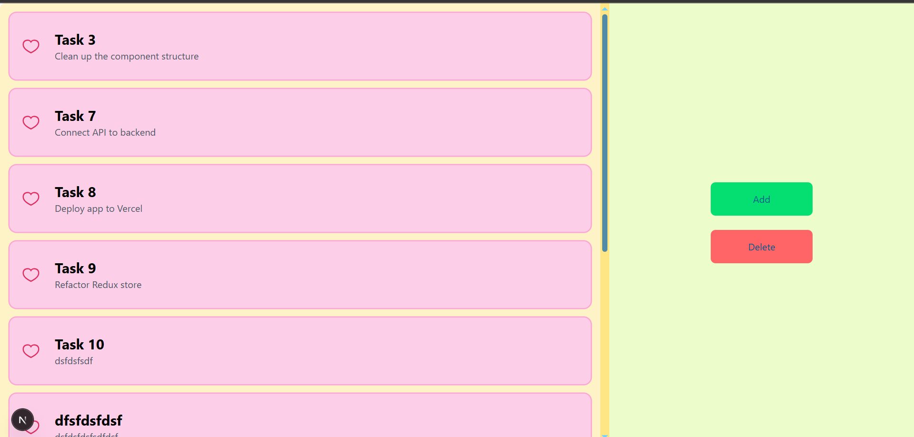

Work in progress:
Building a simple ToDo app to practice React, Redux Toolkit, and TailwindCSS. Currently implementing core features like creating, editing, deleting, and marking tasks done with optimistic UI updates.

Next steps:
After finishing the frontend, planning to improve the backend or connect to a real API.

